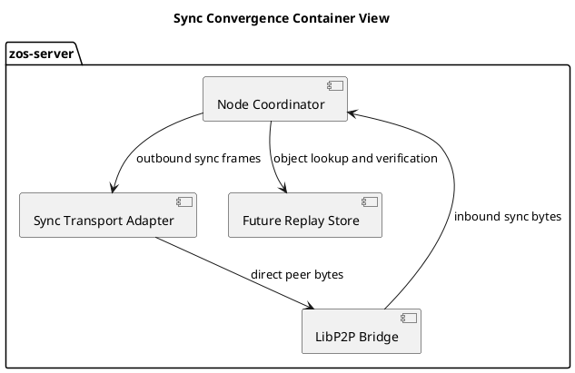
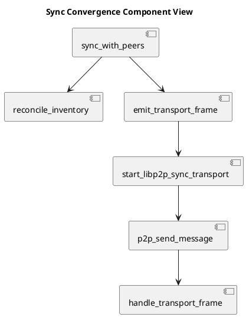
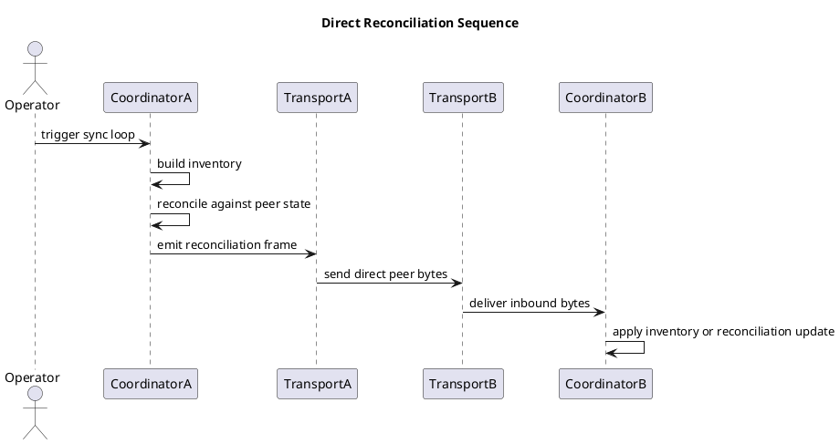

# Sync Convergence Architecture

## Purpose

Define the current sync convergence target for this repository in service and
quality terms, not only implementation terms.

This note is the governing design surface for the current pass.

It describes:

- the bounded convergence scope
- the current component boundaries
- the current release gates
- the quality posture required before promotion

It does not declare:

- truth or semantic promotion rules
- trust scoring policy
- MDL-aware replication policy

## ZKP Frame

O:

- repository owner and operators working in this repository
- Codex as implementation agent
- peer ZOS nodes as runtime participants
- sibling artifact systems such as erdfa publish and zkperf as upstream object
  producers, not as the peer sync authority

R:

- make peer sync honest and testable
- exchange compact inventory
- reconcile missing objects
- support direct transport delivery
- preserve replayable artifact identity

C:

- src/node_coordinator.rs
- src/sync_transport.rs
- src/extra_plugins/libp2p_c_interface.rs
- zos-libp2p/src/server.rs
- docs/sync_convergence_architecture.md
- README.md
- TODO.md
- CHANGELOG.md

S:

- coordinator reconciliation now exists and is test-covered
- outbound sync frames can be serialized and forwarded into the current C bridge
- the current libp2p bridge runs a live topic subscription and delivers frames to
  the running coordinator message path
- announcement frames are now emitted by the coordinator sync loop and accepted
  on inbound transport as peer inventory updates
- current coordinator inventory emits typed object identities
- local inventories combine plugin identities with external
  `InventoryKind::Artifact`/`InventoryKind::Receipt` overlays sourced from
  upstream producers, where plugin identity is legacy fallback only

L:

- placeholder sync
- local reconciliation
- direct transport-backed reconciliation
- repeatable multi-node replay
- pubsub and delta refinement
- trust and replication policy

P:

- keep the current direct-transport-first order
- wire inbound and outbound sync bytes through the live libp2p surface before
  adding pubsub
- treat artifact identity and receipt identity as the canonical inventory unit
- treat plugin-name inventory as non-canonical legacy fallback only
- keep replay recovery ephemeral and consumer-like, using acknowledged locator
  data for fetch and digest verification rather than turning `zos-server` into a
  long-lived receipt or timeline authority

G:

- docs, TODO, code, and changelog must agree
- focused tests must pass before promotion
- transport claims must only be made when a real listener and sender path exist
- broad pubsub-driven convergence remains deferred until direct reconciliation
  and replay semantics are working under live multi-node conditions

F:

- live transport listener is wired to coordinator state updates
- live announcement handling is wired through the same sync envelope
- bounded replay intent plus bounded replay locator metadata are now recorded for canonical missing local objects
- the active coordinator now executes bounded artifact and receipt recovery against acknowledged file/http/hf/ipfs-style locators and verifies digest parity before admitting recovered items into local inventory
- stream receipt metadata now carries container/member-path context so zkperf observation receipts can be verified against the matched observation payload rather than the enclosing tar blob
- the libp2p bridge now exposes explicit same-host listen/dial controls and has a repeatable two-process smoke harness
- replay and cache semantics for peer-fetched objects are still not fully pinned across every producer/sink surface
- some overlays still omit the full acknowledged locator set needed for consumer-style object recovery and digest-verified fetch completion
- inventory unit now uses `InventoryKind` identity objects, combining plugin names
  with artifact and receipt identities loaded from override overlay data
- canonical object identity schema and reconciliation precedence need to be
  explicit for operator use

## Scope

The current scope is only peer convergence for bounded artifact state.

Current in-scope slices:

- inventory exchange
- missing-object reconciliation
- direct peer transport
- replayable object identity
- focused verification

## Canonical Sync Identity v1

This section defines the narrow v1 identity contract used by reconciliation.

### Contract

Every reconciled entry MUST be represented as one of:

- `InventoryKind::Artifact`
- `InventoryKind::Receipt`

Canonical identity key:

`canonical_sync_identity_v1 = (kind, object_id, content_digest, producer_contract, producer_locator_set)`

Where:

- `kind`: `artifact` or `receipt`
- `object_id`: producer-stable object identifier
  - examples:
    - `artifact:<digest-or-manifest-id>`
    - `zkperf-obsv:<hex>`
- `content_digest`: immutable payload digest for replay and equality checks
- `producer_contract`: producer schema/contract version
  - examples:
    - `erdfa-manifest/v1`
    - `zkperf-observation/v1`
- `producer_locator_set`: one or more verifiable producer locators
  - examples:
    - `hf://datasets/<repo>/<path>@<revision>`
    - `ipfs://<cid>`

### Reconciliation precedence

Reconciliation MUST use this precedence:

1. canonical artifact/receipt identity tuple
2. canonical digest equality
3. producer locators for fetch/replay
4. plugin name (legacy fallback only)

Replay recovery in this repo SHOULD follow the bounded ITIR consumer shape:

`selector or identity -> acknowledged locator or objectRef -> fetch -> digest verification`

This repo MAY cache bounded replay metadata for recovery planning, but MUST NOT
claim canonical receipt-history or timeline authority.

Plugin-name inventory MAY be emitted for compatibility and operator debugging,
but MUST NOT be treated as canonical identity for convergence decisions.

### Grounding in current ITIR artifacts

This contract is grounded in the currently produced ITIR surfaces:

- zkperf observation identity:
  - `zkperf-obsv:<hex>`
- stream and index publication receipts:
  - HF ack revisions for tar/index publication
- artifact locators:
  - HF and IPFS locator forms used during publish/read-back verification

The sync contract therefore reconciles by identity plus digest and treats
transport/plugin labels as delivery metadata, not truth.

Current out-of-scope slices:

- trust scoring
- ranking or truth policy
- MDL-aware placement
- broad pubsub fanout as the primary convergence mechanism
- delta-sync promotion before replay and live convergence are proven
- StatiBaker-style long-lived observer memory or governance-ledger behavior

## C4 Level 1

```plantuml
@startuml
title Sync Convergence System Context

Person(operator, "Operator")
System(zos, "ZOS Server", "Peer sync and convergence runtime")
System_Ext(peer, "Peer ZOS Node", "Remote convergence participant")
System_Ext(erdfa, "Artifact Publisher", "Manifest, container, receipt producer")
System_Ext(zkperf, "ZKPerf Receipt Producer", "Execution receipt producer")

Rel(operator, zos, "Runs and promotes")
Rel(zos, peer, "Exchanges inventory and missing objects")
Rel(erdfa, zos, "Supplies artifact identity surfaces")
Rel(zkperf, zos, "Supplies receipt identity surfaces")

@enduml
```

## C4 Level 2



## C4 Level 3



## Sequence



## ITIL Reading

Service strategy:

- convergence is a bounded service, not a general messaging substrate
- service value is deterministic peer state alignment for artifact identity

Service design:

- coordinator owns reconciliation logic
- transport adapter owns delivery only
- replay and fetch policy must be explicit before broader rollout

Service transition:

- additive changes only in the current pass
- no promotion of pubsub-first architecture before direct transport is proven

Service operation:

- focused sync tests are the minimum operational validation surface
- runtime transport claims require both send and receive paths

Continual improvement:

- continue refining artifact/receipt merge/validation and transport-driven fetch replay
- add delta sync only after correctness is stable

## ISO 9001 Reading

Quality intent:

- documented behavior before implementation
- traceable object identity
- measurable verification gates

Quality controls:

- requirements captured in this note and the README
- TODO records remaining controlled gaps
- changelog records only completed behavior changes
- tests provide objective evidence

Nonconformance rule:

- do not claim completed peer sync while inbound transport is unwired
- do not claim artifact convergence while inventory remains a placeholder

## Six Sigma Reading

Critical to quality:

- peer inventory accuracy
- deterministic reconciliation result
- replayable object identity
- transport delivery parity

Defect definition:

- missing object not detected
- reconciliation result not persisted
- frame emitted but not deliverable
- delivered frame not decodable into coordinator state

Current control plan:

- unit tests for reconciliation and frame encoding
- unit tests for replay intent planning and duplicate transport suppression
- documentation gate before implementation
- changelog gate after implementation

## Release Gates

Gate 1:

- coordinator reconciliation tests pass

Gate 2:

- outbound sync frames reach the live transport path

Gate 3:

- inbound transport bytes update coordinator state through the same envelope
- live inbound/outbound sync routing is active on the running `ZosNode` loop

Gate 4:

- announcement traffic updates peer inventory through the same typed sync envelope
- focused coordinator tests cover announcement, reconciliation, and inventory frame order

Gate 5:

- object replay and verification rules are explicit enough for multi-node tests

Gate 6:

- only after Gates 1 through 5 pass should broader pubsub or delta sync be promoted

## Current Decision

The current implementation order remains:

1. direct inventory and reconciliation correctness
2. live direct transport binding with announcement handling
3. replay intent planning and replayable object identity
4. actual fetch and replay semantics
5. live multi-node convergence validation
6. pubsub and delta refinement
7. trust and replication policy later
